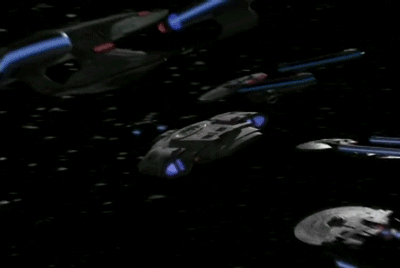
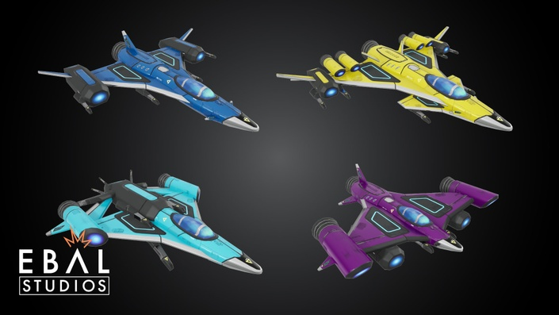
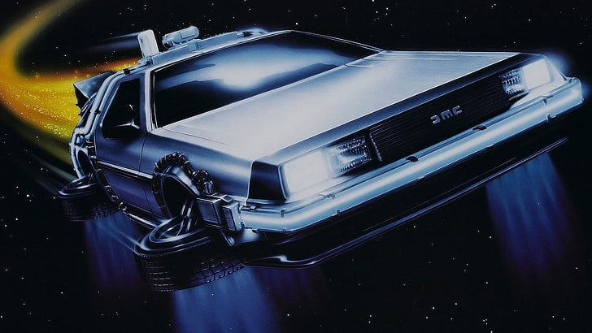

# Project Proposal - Semester 2 Space Battle
 - A space-battle recreation made in Unity which plays out autonomously.
 - All spaceships and entities will be programmed to operate without player input, with camera angles/animations changing to suit the required scene.
 - Rather than copying a previously existing space battle from film/TV I am going to create my own using models from the Star Sparrow asset pack. (**I have included generic space-battle images/GIFs below to act as 
 storyboards for the general aesthetic I want to capture with my own scene**).
 - Building upon the previous work done for this repository for Semester 1 I would also like to implement the option for players to choose any ship within the scene and allow them to operate it themselves.

     
     

  
  
  
  

Original Game Engines Semester 1 Concept & Implementations

# Video of Current Project Build

   

 - What I'm Happiest With / What I'm Most Proud Of:
	- I'm most proud of the fact that all of the code implemented in my project were created by me from scratch. 
	Generally when working on small prototypes such as this one, I use Unity's in-built character controllers, 
	however for this project I created my own camera control and movement scripts (though I didn't use the movement script in the end).
	- Another feature I'm very happy with is the turret system I created for the ship. Both turrets are setup independently of one another, with most of their
	variables being set to public so they can be declared within the inspector instead of being hard-coded. The 'holographic' displays I created to display
	the current ammo of each weapon also suits the project very well thematically.

# Implemented Features (What I Did):
 - [x] Turrets follow mouse cursor/screen centre
	- Camera to world-point so turrets know what to aim towards
 	- A canvas out in front of the ship with a reticle on it displays where the turrets will fire

 - [x] Both turrets fire in tandem and reload together
	- Which turret that fires depends on which mouse button is pressed
	- Each turret reloads when empty or both reload when players press R (**While either turret is reloading players cannot shoot, 
	this adds a tactical element to gameplay of when players should choose to reload**)
	- If turret is not being fired it regains charge, however if player presses reload the battery of both turrets gets changed – full ammo

 - [x] Holographic display above turrets show ammo count/energy remaining (**This was simple to implement but gave an incredibly satisfying result in-game**)
	- Place canvas in world-space above/beside each turret
	- Assign the TMP element as the ammo display – digital font
	- Colour to make seem like hologram

 - [x] Spawn asteroids
	- Create an array of points where asteroids can spawn from
	- Choose random point from range and Spawn()
	- Asteroid has a health element (**When more variability is added in future the health values of some obstacles will be different to others**)
 
 - [x] Asteroid flies towards ship
	- Start()/OnAwake() – as the player position is currently locked this was a simple matter of the asteroid making it's way directly to the player
	- Asteroids have a 'Tumble' variable which gives them a random spin while they fly towards the player

 - [x] Particle effect on asteroid destruction
	- An explosion is instantiated whenever an asteroid is destroyed
	- Points are only earned if the player shoots an asteroid to destroy it

 - [x] Asteroid damages ship hull integrity on collision
	- Asteroids explode on contact with ship – causing damage to it (**I would like to expand on this so that different obstacles/larger asteroids would cause increased damage**)
	- Ship explodes when health reaches 0

 - [x] Multiple sound effects added
	- Turrets firing & reloading
	- Asteroid blowing up

# Cut / Future Features:

 - [ ] Starry background moves to show player momentum (**Left out due to lack of time**)
	- Skybox scrolls behind player – alter speed when ship gains momentum or under other circumstances – perhaps as players survive the ship speeds up and score begins to increase exponentially.

 - [ ] Player flies towards effect being made by sound input (**I did create an Audio-Visualizer Feature, howver it remains around the player rather than a target for them to fly towards**)
	- Blackhole-like target in the centre of screen that player is constantly flying toward
	- Blackhole pulses/changes shape/colour based on music being input either via audio (**Successfully had the array change with the audio spectrum, 
	I think a changing colour scheme would add nicely to this in future**)

 - [x] Player can move up/down/left/right to avoid danger (**This was functional but I decided to leave it out of the current build, 
	I felt at the stage the project is currently, removing this feature allowed it to feel more polished**)
	- Input axis determines ship moving in game world-space, this will need a maximum distance in any direction

 - [ ] Randomly generate asteroid shape (**I left this out, instead using an asteroid prefab for this prototype**)

 - [ ] Powerups – infinite ammo for short time, invincibility, regain health, bonus points (**This is a feature I would love to implement in future, 
	programming them would be quite straightforward, unfortunately other tasks took precedent for this build**)
	- Powerups will need to be flown into or perhaps shot to collect them – some may take more shots than others depending on their value to gameplay

 - [ ] Controller support – stretch goal (**As stated, once there are more implemented features this would be a nice touch to add to the player experience**)
	- Should be a simple matter of adding controller key-binds as the alt input of all other controls

# Project Proposal / Original Concept
 - An **interactive** Audio-Visualiser **game**
 - Players will take control of a **starship/turret** in the bottom centre of the screen 
   (somewhere between the * *Dead Space* * & * *Star Fox* * gameplay below)

   
   

 - **Asteroids** will be **procedurally created** in the path of the player and they will need to destroy them to survive
 - The obstacles which arise will be **randomly generated** (i.e. things will not spawn in the same place/order on consecutive playthroughs)
 - Asteroids the player destroys and power-ups they collect will afford them **extra points**
 - Though there will be a score-system implemented, the **main goal** of this project will be **to display impressive visuals** to the accompanying music track
 - Whatever **audio** is being played in the background **will affect the visual space** on-screen
   (similar to the visualiser below)

   

 
